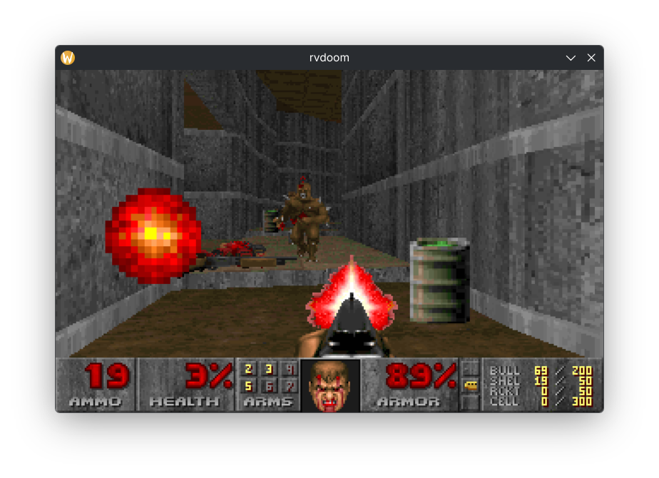

# rvcore: RV32I emulator

`rvcore` is a single-core RISC-V emulator that implements the RV32I ISA, except for the `FENCE` and `EBREAK` instructions, which are currently `NOP`.

## Output

## Milestones

- [x] Run flat binaries written in assembly language

- [x] Run flat binaries written in C language

- [x] Run ELF binaries (binaries with a single `PT_LOAD` segment work)

- [x] Implement the `newlib` stubs needed to run DOOM

- [x] Get DOOM to boot

- [ ] Make DOOM playable

- [ ] Implement the M extension