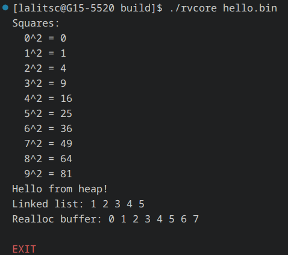

# rvcore: A tiny RISC-V emulator that runs DOOM



<div align="center">
  DOOM running in rvcore | <a href="https://youtu.be/f5uygzEmdLw?si=Q32DF_eGzetCb8SE">Video demo</a>
</div>
<br/>

`rvcore` is a RISC-V emulator that serves as a minimal environment capable of running DOOM. It implements the RV32IM ISA except for the `FENCE` and `EBREAK` instructions, which are currently stubbed.

## Milestones

- [x] Run flat binaries written in assembly

- [x] Run flat binaries written in C

- [x] Load ELF binaries (binaries with a single `PT_LOAD` segment work)

- [x] Implement the `newlib` stubs needed to run DOOM

- [x] Get DOOM to boot

- [x] Make DOOM playable

- [x] Implement the M extension

## Build instructions

1. To build, CMake and GCC/Clang is required (for Windows, [MSYS2](https://www.msys2.org/) with `mingw-w64-ucrt-x86_64-toolchain` or [Cygwin](https://www.cygwin.com/) is needed)
2. Dependencies (SDL3): `libsdl3-dev` / `sdl3-devel` / `sdl3`
3. Run

    ```
        mkdir build
        cmake -B build -DCMAKE_BUILD_TYPE=Release
        cd build
        cmake --build .
    ```

## Build instructions for doomgeneric

1. Clone https://github.com/lalitshankarch/doomgeneric
2. `riscv64-unknown-elf-gcc` or the `riscv64-gnu-toolchain` configured with `./configure --with-multilib-generator="rv32im-ilp32--"` must be installed
3. Navigate to `doomgeneric` and run `make`

## Running other programs

Navigate to the `examples` directory to see how to run simple C programs on `rvcore`. Only a few essential newlib stubs are implemented.

To implement a new stub, first modify `stubs.h` and then add the appropriate handler in `cpu.cpp`.
